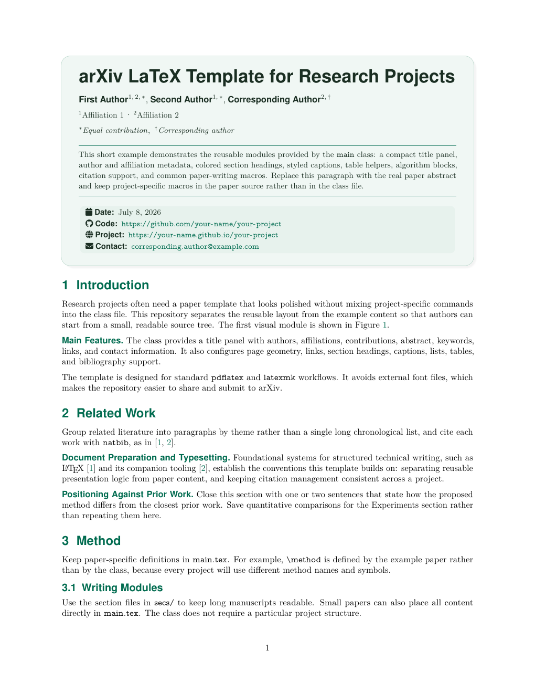
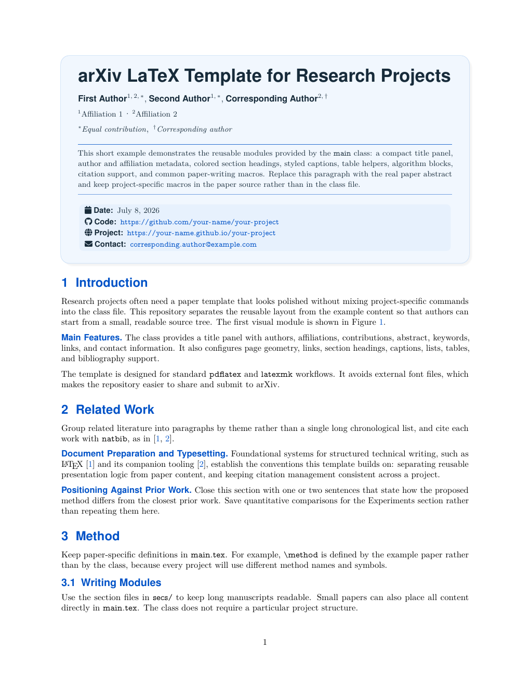
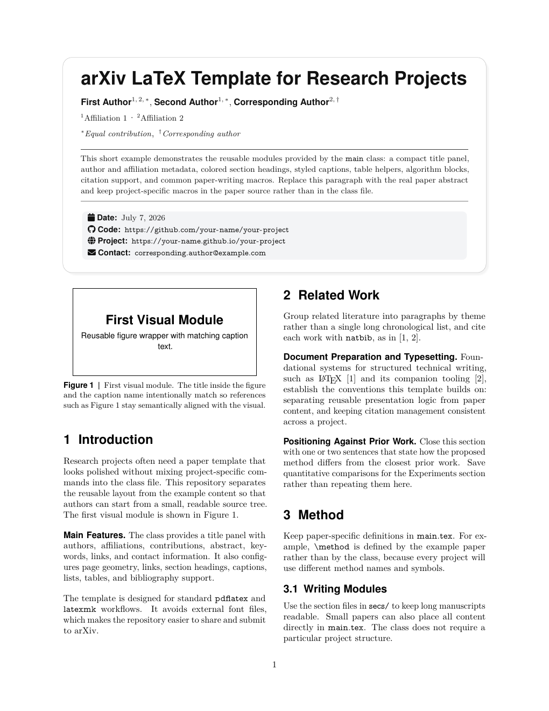
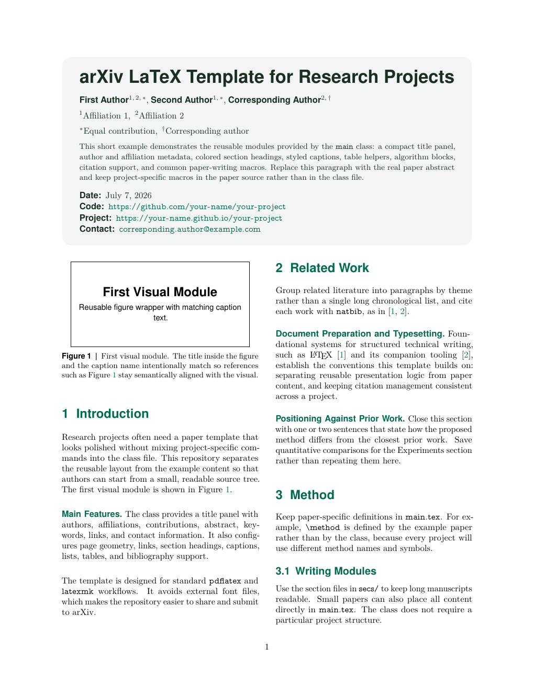
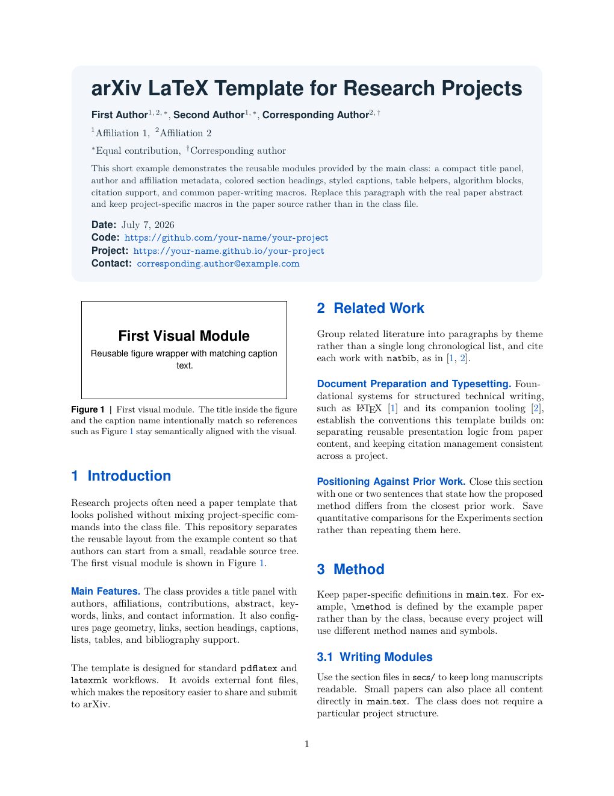
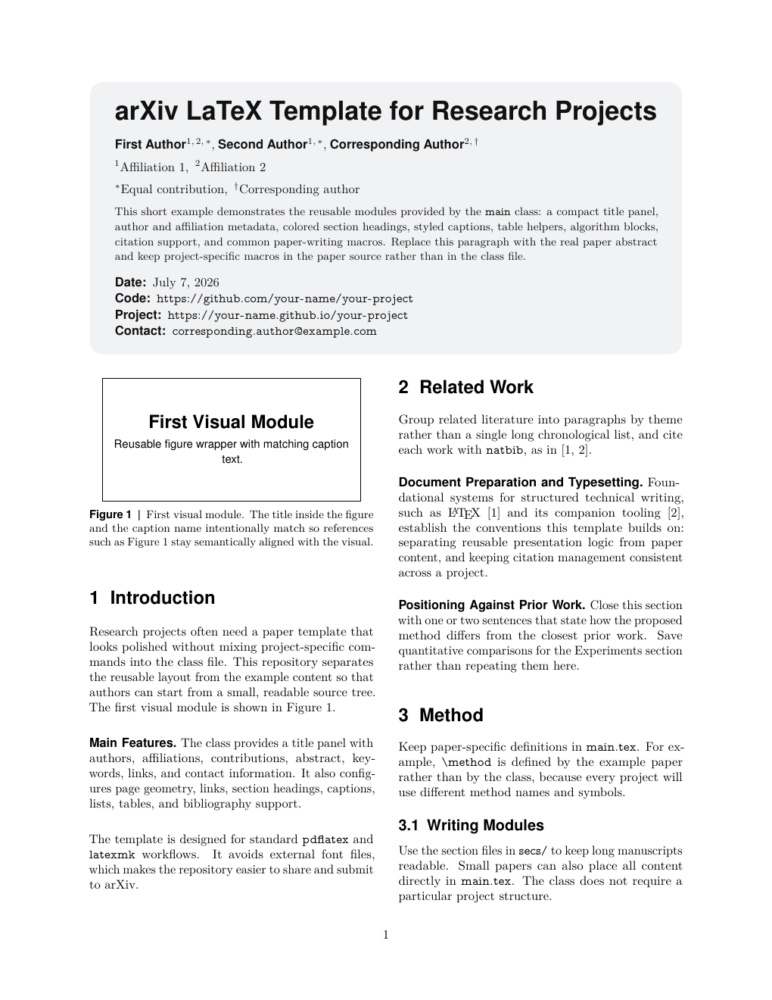

# arXiv TeX Template

[](https://www.overleaf.com/docs?snip_uri=https%3A%2F%2Fgithub.com%2Fwanghao9610%2FarXivTeX%2Farchive%2Frefs%2Fheads%2Foverleaf.zip)

**Language:** English | [简体中文](README.zh-CN.md)

A compact, arXiv-style LaTeX template for research papers. The project follows
a modular organization: `main/main.tex` is the entry point, while sections,
figures, tables, algorithms, appendix material, and bibliography data each
live in their own files under `main/`.

## Contents

- [Key Features](#features)
- [Requirements](#requirements)
- [Project Organization](#project-organization)
- [Paper Styles](#paper-styles)
- [Selectable Themes](#selectable-themes)
- [Quick Start](#quick-start)
- [arXiv Pre-Print](#arxiv-pre-print)
- [Venue Template](#venue-template)
- [Class API](#class-api)
- [Minimal Example](#minimal-example)
- [Adding Content](#adding-content)
- [License](#license)

## Key Features

- **Article-Based Class**: One-column and two-column layouts.
- **Title Panel**: Title, authors, affiliations, abstract, keywords, and
  code/project/dataset links in one block.
- **Selectable Themes**: Green, blue, and black color palettes.
- **Paper Helpers**: `\parahead`, `\headbf`, `\tablestyle`, `\cmark`,
  `\xmark`, compact table columns, `cleveref`, and `natbib`.
- **Portable Fonts**: Standard TeX Live fonts only, no external assets.
- **Effortless Conversion**: the `convert-arxiv` skill for an [arXiv Pre-print](#arxiv-pre-print); the `convert-template` skill for
  [Venue Templates](#venue-template).

## Requirements

- A TeX Live distribution (2022 or later recommended) with `latexmk` on
  `PATH`. The class loads common packages such as `fontawesome5`,
  `nicematrix`, `siunitx`, and `tcolorbox`, so a full/`scheme-full` install
  avoids missing-package errors.
- `latexpand` and `perl` for `make convert-arxiv` (both ship with most TeX Live
  installs).
- Bibliography entries are compiled automatically by `latexmk` from
  `main/main.bib` using the `unsrtnat` style; no separate BibTeX setup is
  required.

## Project Organization

The layout mirrors a larger paper repository while staying small enough for a
starter template:

```text
.
+-- main/                 # Main paper source tree used for local builds
|   +-- main.tex          # Entry point: metadata, global macros, input order
|   +-- main.cls          # Reusable arXiv-style class
|   +-- main.bib          # BibTeX entries
|   +-- appx.tex          # Optional appendix entry
|   +-- secs/             # Main paper section fragments
|   |   +-- 00_abstract.tex
|   |   +-- 01_introduction.tex
|   |   +-- 02_related.tex
|   |   +-- 03_method.tex
|   |   +-- 04_experiments.tex
|   |   +-- 09_conclusion.tex
|   |   +-- 10_results.tex
|   |   +-- 11_reproducibility.tex
|   |   +-- 12_impact.tex
|   +-- figs/             # Figure environment wrappers
|   |   +-- 00_teaser.tex
|   |   +-- 10_figure.tex
|   |   +-- srcs/         # Raw PDF/PNG/JPG assets
|   +-- tabs/             # Table environment wrappers
|   |   +-- 00_example.tex
|   |   +-- 10_extra.tex
|   +-- algs/             # Algorithm environment wrappers
|       +-- 00_example.tex
|       +-- 10_procedure.tex
+-- arXiv/                # Generated flattened submission package
+-- submit/               # Generated submission copies
+-- templates/            # Unzipped venue template files
+-- .temp/                # Generated build files
+-- .vscode/settings.json # Optional LaTeX Workshop settings
+-- Makefile              # Build commands
```

The following conventions keep the tree consistent as a paper grows.

### File naming

All modular files under `main/secs/`, `main/figs/`, `main/tabs/`, and
`main/algs/` (and raw assets under `main/figs/srcs/`) use a two-digit prefix
before the descriptive name:

| Digit | Meaning |
| --- | --- |
| First (`0`, `1`, …) | Paper part: `0` = main body, `1` = appendix |
| Second (`0`, `1`, …) | Order within that part |

Examples:

| Folder | Main body | Appendix |
| --- | --- | --- |
| `main/secs/` | `00_abstract.tex`, `01_introduction.tex` | `10_results.tex` |
| `main/figs/` | `00_teaser.tex`, `01_framework.tex` | `10_figure.tex` |
| `main/figs/srcs/` | `00_teaser.pdf`, `01_framework.pdf` | `10_figure.pdf` |
| `main/tabs/` | `00_main_results.tex` | `10_extra.tex` |
| `main/algs/` | `00_training.tex` | `10_pseudocode.tex` |

Keep wrapper and asset basenames aligned (for example,
`main/figs/00_teaser.tex` points to `main/figs/srcs/00_teaser.pdf`).

### Layout

- Put section fragments in `main/secs/` and include them from
  `main/main.tex`.
- Put figure environments in `main/figs/` and raw assets in
  `main/figs/srcs/`.
- Put long table code in `main/tabs/` and include it with
  `\input{tabs/...}`.
- Put algorithm environments in `main/algs/`.
- Keep project-specific macros in `main/main.tex`; keep reusable presentation
  logic in `main/main.cls`.

### Folder guide

- `main/secs/`: store section fragments and include them from
  `main/main.tex` with
  `\input{secs/...}`. Examples include `00_abstract.tex`,
  `01_introduction.tex`, and `10_results.tex`.
- `main/figs/`: store reusable `\begin{figure}...\end{figure}` blocks and
  include them from section files with `\input{figs/...}`. Examples include
  `00_teaser.tex`, `01_framework.tex`, and `10_figure.tex`.
- `main/figs/srcs/`: store raw figure files such as PDF, PNG, or JPG assets.
  Reference them from figure wrappers with paths such as
  `figs/srcs/00_teaser.pdf`. Use the same basename as the matching wrapper
  when possible.
- `main/tabs/`: store reusable `\begin{table}...\end{table}` blocks and
  include them from section files with `\input{tabs/...}`. Examples include
  `00_main_results.tex` and `10_extra_results.tex`.
- `main/algs/`: store reusable `\begin{algorithm}...\end{algorithm}` blocks and
  include them from section files with `\input{algs/...}`. Examples include
  `00_training.tex` and `10_pseudocode.tex`.

The same two-digit prefix scheme applies to `main/secs/`, `main/figs/`,
`main/figs/srcs/`, `main/tabs/`, and `main/algs/`.

## Paper Styles

Set `\paperstyle{...}` before `\begin{document}` to choose the title panel
layout. Combine it with `\papercolor{...}` to choose the color palette. The
gallery below shows the first page of the example paper rendered with every
current style and color combination.

| Style | `green` | `blue` | `black` |
| --- | --- | --- | --- |
| `fancy` |  |  |  |
| `simple` |  |  |  |

## Selectable Themes

Set `\paperstyle{...}` to `fancy` or `simple`, and set `\papercolor{...}` to
`green`, `blue`, or `black`. The legacy `\papertheme{...}` command remains as an
alias for `\papercolor{...}`.

## Quick Start

Compile the example:

```bash
make
```

The default build target writes generated files to `.temp/`, including
`.temp/main.pdf`. Override `MAIN_DIR`, `MAIN`, or `OUT_DIR` to point at a
different source tree, entry file, or output directory, for example
`OUT_DIR=build make`.

Alternatively, run LaTeX directly:

```bash
cd main && latexmk -pdf -outdir=../.temp main.tex
```

Prepare a flattened arXiv source bundle:

```bash
make convert-arxiv
```

This writes the flattened upload entry file directly to `arXiv/main.tex`.

## arXiv Pre-print

Run `make convert-arxiv` after editing to produce a flattened, submission-ready copy
of the paper. A `convert-arxiv` skill (bundled for Claude Code, Codex, Cursor,
and other agents under `.claude/skills/convert-arxiv/`,
`.codex/skills/convert-arxiv/`, `.cursor/skills/convert-arxiv/`, and
`.agents/skills/convert-arxiv/`) automates this with prerequisite checks and a
standalone-compile verification pass:

1. Edit the paper under `main/` as usual, then ask your agent to package it,
   for example:
   > Package this paper for an arXiv submission.

   or

   > Run make convert-arxiv and confirm the output compiles.
2. The agent confirms `latexpand` and `perl` are on `PATH`, runs
   `make convert-arxiv`, and checks the generated `arXiv/MANIFEST.txt` against the
   actual output.
3. It compiles `arXiv/main.tex` standalone (inside `arXiv/`, not `main/`) to
   confirm the flattened copy has no hidden dependency on files outside
   `arXiv/`, then reports back — pass, fail with the error, or "not
   verified" if no TeX toolchain is available in the environment.
4. Fix any reported gaps under `main/` — never inside `arXiv/`, which is
   fully regenerated on every run — and ask the agent to re-run.
5. Submit the contents of `arXiv/`; the entry point is `arXiv/main.tex`.

You can also skip the agent and run `make convert-arxiv` yourself:

- The command runs `latexpand main.tex > ../arXiv/main.tex` from `main/`, then
  fills out the rest of `arXiv/` with the local class, bibliography, and
  figure assets. Submit the contents of `arXiv/` — the package entry point is
  `arXiv/main.tex`.
- It copies `main/*.cls`, `main/*.sty`, `main/*.bst`, `main/*.bib`,
  `main/*.bbx`, and `main/*.cbx` files, copies source-tree assets from
  `main/figs/srcs/` into `arXiv/srcs/` and rewrites the flattened
  `arXiv/main.tex` paths accordingly, and also copies `main/srcs/` when
  present to support flatter source-tree layouts.

A few things to keep in mind:

- Keep project-specific macros in `main/main.tex`, not in `main/main.cls`.
- Prefer PDF, PNG, or JPG figures and avoid absolute file paths.
- Do not submit `.temp/`, editor settings, SyncTeX files, logs, or local
  preview PDFs.
- If arXiv reports a missing package, move that feature from the class into
  the paper source or remove it before submission.

Advanced usage — override the entry point or output directory:

```bash
MAIN=submission.tex ARXIV_DIR=arXiv-submission make convert-arxiv
```

## Venue Template

A `convert-template` skill (bundled for both Claude Code and Codex, under
`.claude/skills/convert-template/` and `.codex/skills/convert-template/`)
converts this paper into a submission copy for an officially-supplied venue
LaTeX template — for example CVPR, ICCV, or NeurIPS.

1. Get the official author kit for your target venue (a zip containing its
   `.cls`/`.sty`/`.bst` files and a sample `.tex`) and have it ready locally.
   The skill never fetches or guesses a venue template itself — you always
   supply the official zip.
2. Ask your agent (in Claude Code or Codex) to convert the paper, giving it
   the zip's path and which mode you want, for example:
   > Convert this paper to the CVPR template at `~/Downloads/cvpr2025.zip`,
   > anonymous review mode.

   or

   > Now generate the camera-ready version for the same CVPR template.
3. The agent unpacks the kit into `templates/<venue>/`, then generates a
   standalone, compilable copy under `submit/<venue>/` — including a
   `compat.sty` shim so this template's helpers (`\parahead`, `\figref`,
   `\tablestyle`, the compact column types, etc.) keep working under the
   venue's own class, and a new `main.tex` with the venue's native
   title/author macros populated from this paper's metadata.
4. Choose `anonymous` mode for a blind-review draft (author names,
   affiliations, and code/project/dataset links are redacted) or
   `camera-ready` mode for the final submission with full author metadata.

`main/` and `main/main.bib` are never modified by this process, and neither
are the official venue files it copies in. `templates/` and `submit/` are
gitignored, since venue kits are usually copyrighted and `submit/<venue>/`
is fully regenerated from `main/` each time you re-run the conversion — edit
the paper under `main/`, then re-run the skill to refresh the submission
copy.

## Class API

Use these commands before `\begin{document}`:

| Command | Purpose |
| --- | --- |
| `\paperstyle{fancy}` | Selects the title style. Available styles: `fancy`, `simple`. |
| `\papercolor{green}` | Selects a color. Available colors: `green`, `blue`, `black`. |
| `\papertheme{green}` | Legacy alias for `\papercolor{green}`. |
| `\title{...}` | Paper title shown in the title panel. |
| `\author[1,2]{Name}` | Adds an author with optional affiliation markers. |
| `\affiliation[1]{Institution}` | Adds an affiliation. |
| `\contribution[\dagger]{Text}` | Adds contribution or equal-contribution notes. |
| `\abstract{...}` | Adds the abstract to the title panel. |
| `\keywords{...}` | Adds keywords below the abstract. |
| `\code{URL}` | Adds a code link. |
| `\project{URL}` | Adds a project-page link. |
| `\dataset{URL}` | Adds a dataset link. |
| `\demo{URL}` | Adds a demo link. |
| `\correspondence{...}` | Adds contact information. |
| `\metadata[Label:]{Value}` | Adds a custom metadata row. |

Use these commands in the paper body:

| Command | Purpose |
| --- | --- |
| `\parahead{Title}` | Inline theme-colored sans-serif bold paragraph heading, followed by a period and a space. |
| `\headbf{Text}` | Theme-colored sans-serif bold text, with no automatic punctuation or spacing. |
| `\figref{fig:label}` | Figure reference styled as `Figure 1`. |
| `\tabref{tab:label}` | Table reference styled as `Table 1`. |
| `\algref{alg:label}` | Algorithm reference styled as `Algorithm 1`. |
| `\eqnref{eq:label}` | Equation reference styled as `Equation (1)`. |
| `\tablestyle{4pt}{1.1}` | Sets table column spacing and row stretch. |
| `\cmark`, `\xmark` | Check and cross symbols for comparison tables. |
| `x`, `y`, `z`, `P`, `Y` column types | Compact table column helpers. |

## Minimal Example

```tex
\documentclass[twocolumn]{main}

\papertheme{green}

\title{Your Paper Title}
\author[1]{First Author}
\author[1,2]{Second Author}
\affiliation[1]{Example University}
\affiliation[2]{Example Research Lab}

\abstract{Write a concise summary of the paper.}
\keywords{keyword one, keyword two}
\date{\today}
\code{https://github.com/your-name/your-project}
\project{https://your-name.github.io/your-project}
\correspondence{\email{name@example.com}}

\input{secs/00_abstract.tex}

\begin{document}
\maketitle

\section{Introduction}
Your paper starts here.
\input{figs/00_teaser.tex}

\bibliographystyle{unsrtnat}
\bibliography{main}
\end{document}
```

## Adding Content

Add a new section:

```tex
% main/main.tex
\input{secs/04_more_experiments.tex}
```

Add a new figure:

```tex
% main/figs/01_framework.tex
\begin{figure}[t]
  \centering
  \includegraphics[width=\linewidth]{figs/srcs/01_framework.pdf}
  \caption{Overview of the proposed framework.}
  \label{fig:framework}
\end{figure}
```

Add a new table:

```tex
% main/tabs/01_main_results.tex
\begin{table}[t]
  \tablestyle{4pt}{1.1}
  \caption{Main results.}
  \label{tab:main_results}
  \begin{tabular}{lcc}
    \toprule
    Method & Score & Speed \\
    \midrule
    Baseline & 82.1 & 1.0x \\
    Ours & 85.4 & 1.1x \\
    \bottomrule
  \end{tabular}
\end{table}
```

The starter paper includes the appendix through this line near the end of
`main/main.tex`:

```tex
\input{appx.tex}
```

The appendix entry file is `main/appx.tex`. It starts the appendix and then
includes appendix-specific modules:

```tex
\clearpage
\beginappendix

\input{secs/10_results.tex}
\input{secs/11_reproducibility.tex}
\input{secs/12_impact.tex}
```

`main/secs/12_impact.tex` is a starter broader-impact-and-compute-resources
section — common at venues (e.g. NeurIPS) that require reporting societal
impact and the hardware budget behind reported results. Remove the
`\input` line if your target venue does not require it.

Appendix-specific figures, tables, and algorithms should use the same prefix
range:

- `main/figs/10_figure.tex`
- `main/tabs/10_extra.tex`
- `main/algs/10_procedure.tex`

Comment this line when drafting a main-body-only paper. Keep it enabled when you
want the example PDF to include the appendix pages.

## License

This template is released under the MIT License.
